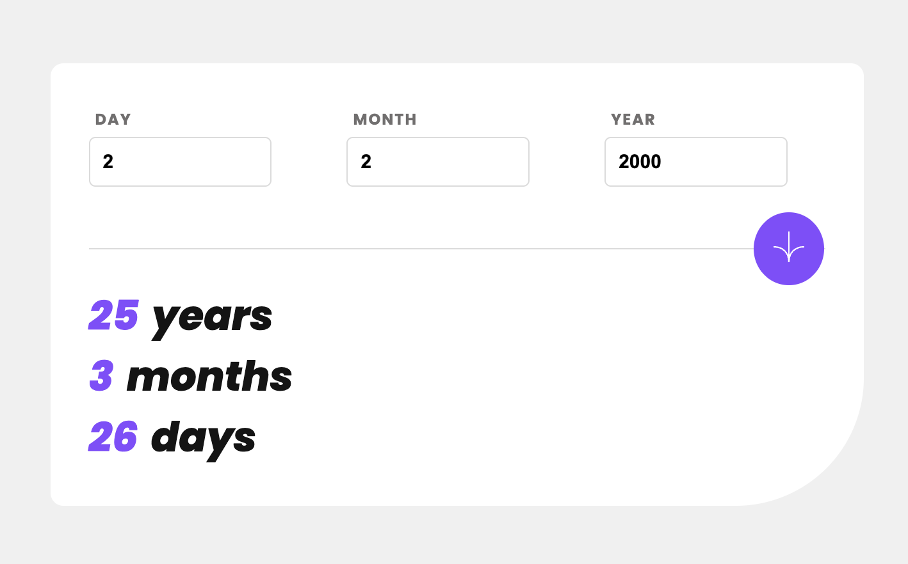

# Age Calculator App
### Screenshot

### Links

- [Source code](https://github.com/JC-ProgJava/FrontendMentor/tree/master/docs/age-calculator-app/)
- [Web view](https://jc-progjava.github.io/FrontendMentor/age-calculator-app/)

## Built with

- Vanilla HTML, CSS, and JS

## Author

- [JC-ProgJava](https://github.com/JC-ProgJava)
- Frontend Mentor - [Frontend Mentor @JC-ProgJava](https://www.frontendmentor.io/profile/JC-ProgJava)
