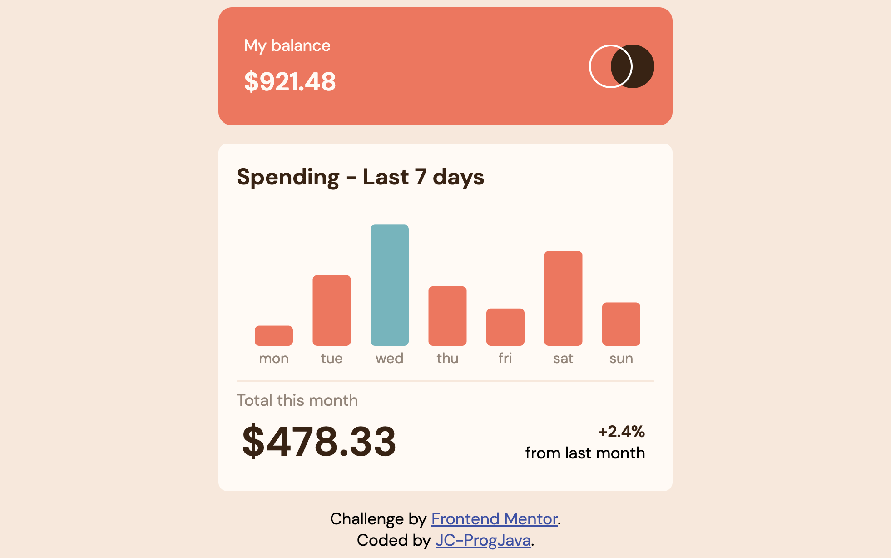

# Frontend Mentor - Expenses chart component solution

This is a solution to the [Expenses chart component challenge on Frontend Mentor](https://www.frontendmentor.io/challenges/expenses-chart-component-e7yJBUdjwt). 

## Overview

### Screenshot

### Links

- [Source code](https://github.com/JC-ProgJava/FrontendMentor/tree/master/docs/expenses-chart-component/)
- [Web view](https://jc-progjava.github.io/FrontendMentor/expenses-chart-component/)

## My process

### Built with

- Raw HTML and CSS
- D3.js (for charting)

### References and Learning Points

## Author

- [JC-ProgJava](https://github.com/JC-ProgJava)
- Frontend Mentor - [Frontend Mentor @JC-ProgJava](https://www.frontendmentor.io/profile/JC-ProgJava)
