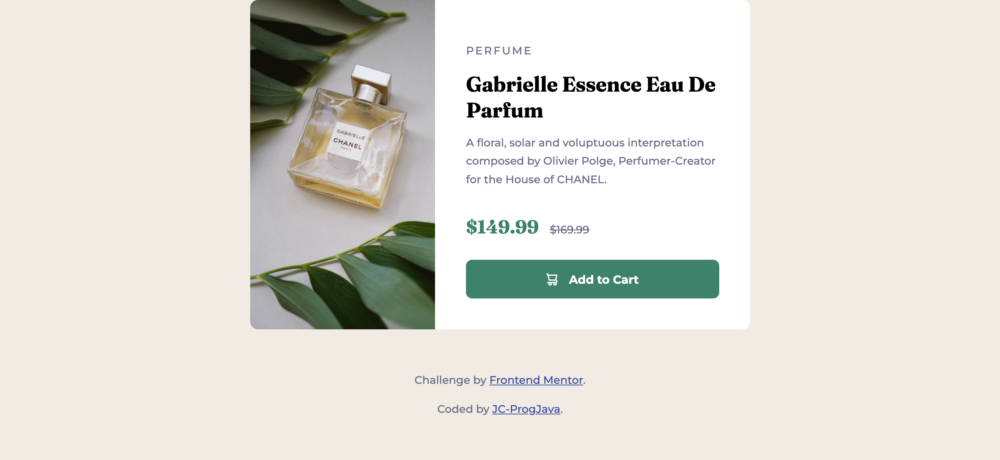

# Frontend Mentor - Product preview card component solution

This is a solution to the [Product preview card component challenge on Frontend Mentor](https://www.frontendmentor.io/challenges/product-preview-card-component-GO7UmttRfa).

## Overview

### Screenshot

### Links

- [Source code](https://github.com/JC-ProgJava/FrontendMentor/tree/master/docs/product-preview-card-component/)
- [Web view](https://jc-progjava.github.io/FrontendMentor/product-preview-card-component/)

## My process

### Built with

- Raw HTML and CSS

### References and Learning Points

I discovered some new CSS attributes including:

- `flex-direction: row | column;` - sets direction components flex in.
- `border-radius: top-left | top-right | bottom-right | bottom-left;` - you can individually
set each corner's radius using `border-radius`.
- `align-self: center;` - centers the element vertically inside a parent element.

## Author

- [JC-ProgJava](https://github.com/JC-ProgJava)
- Frontend Mentor - [Frontend Mentor @JC-ProgJava](https://www.frontendmentor.io/profile/JC-ProgJava)

## Acknowledgements

- [@correlucas](https://www.frontendmentor.io/profile/correlucas) for helpful feedback related to CSS styling.