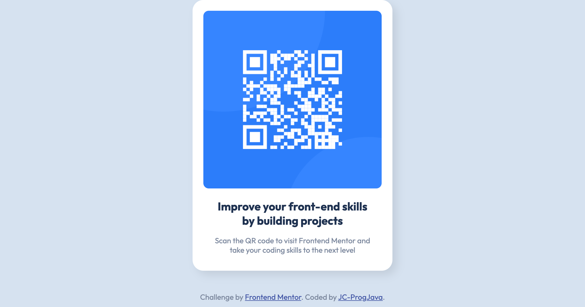

# Frontend Mentor - QR code component solution

This is a solution to the [QR code component challenge on Frontend Mentor](https://www.frontendmentor.io/challenges/qr-code-component-iux_sIO_H). 

## Table of contents

* [Frontend Mentor - QR code component solution](#frontend-mentor---qr-code-component-solution)
  * [Table of contents](#table-of-contents)
  * [Overview](#overview)
    * [Screenshot](#screenshot)
    * [Links](#links)
  * [My process](#my-process)
    * [Built with](#built-with)
    * [References and Learning Points](#references-and-learning-points)
  * [Author](#author)

## Overview

### Screenshot



### Links

- [Source code](https://github.com/JC-ProgJava/FrontendMentor/tree/master/docs/qr-code-component)
- [Web view](https://jc-progjava.github.io/FrontendMentor/qr-code-component/)

## My process

### Built with

- Raw HTML and CSS

### References and Learning Points

The project was relatively simple, however I learned more about using [`box-shadow`](https://developer.mozilla.org/en-US/docs/Web/CSS/box-shadow) and 
[Viewports](https://developer.mozilla.org/en-US/docs/Web/CSS/Viewport_concepts) by checking out their respective MDN documentation pages.

For example, I implemented the box shadow for the QR Code component as:

```css
box-shadow: 8px 8px 16px rgba(0, 0, 0, 0.09);
```

Which follows the form:
```css
box-shadow: offset-x | offset-y | blur-radius | color;
```

I implemented viewports through using: 
```css
@media screen and (min-width: 700px) {...}
@media screen and (max-width: 700px) {...}
```
to specify different configurations of the width of the QR Code component depending on the screen size.

## Author

- [JC-ProgJava](https://github.com/JC-ProgJava)
- Frontend Mentor - [Frontend Mentor @JC-ProgJava](https://www.frontendmentor.io/profile/JC-ProgJava)
